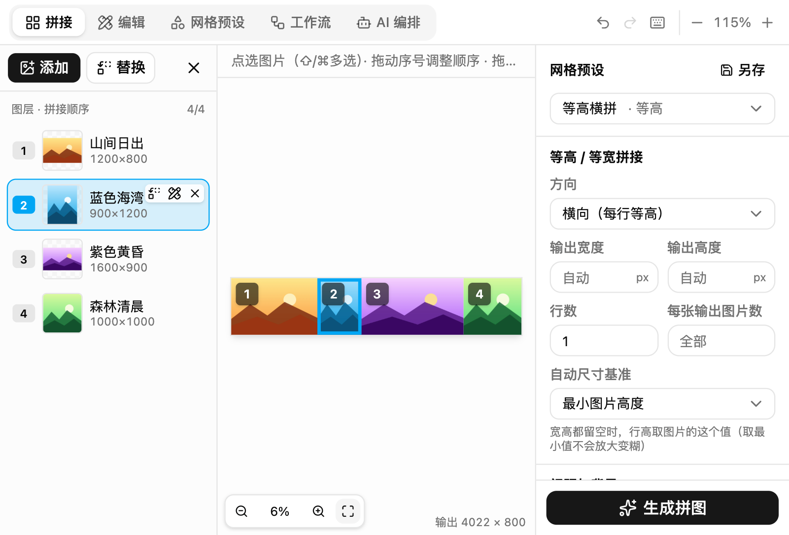
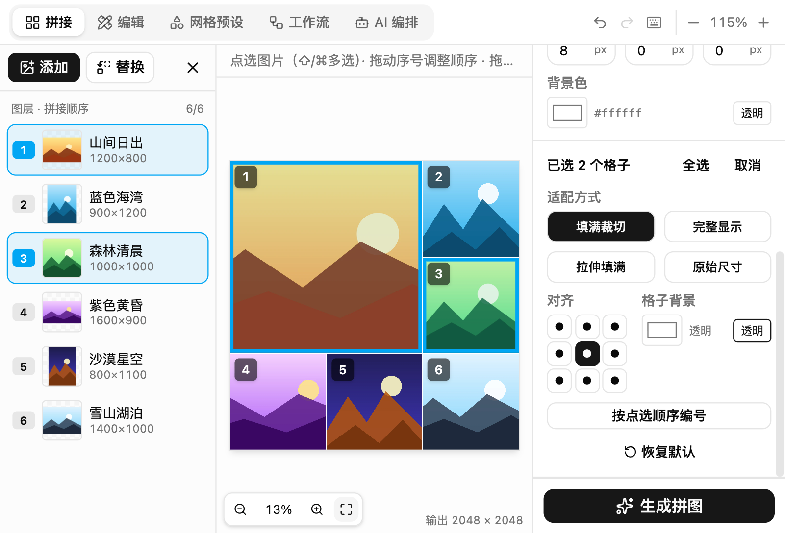
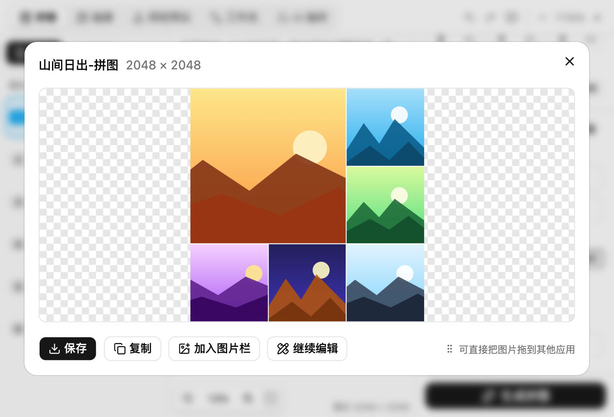
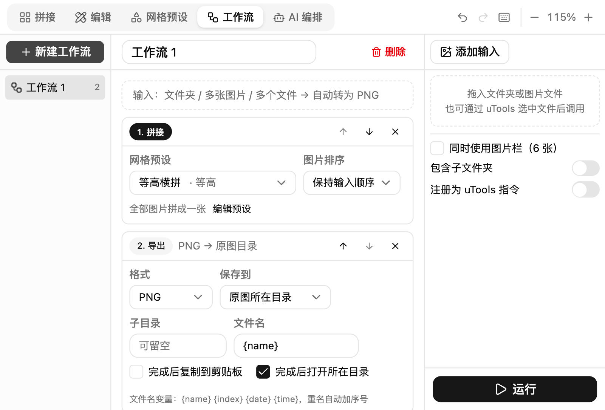
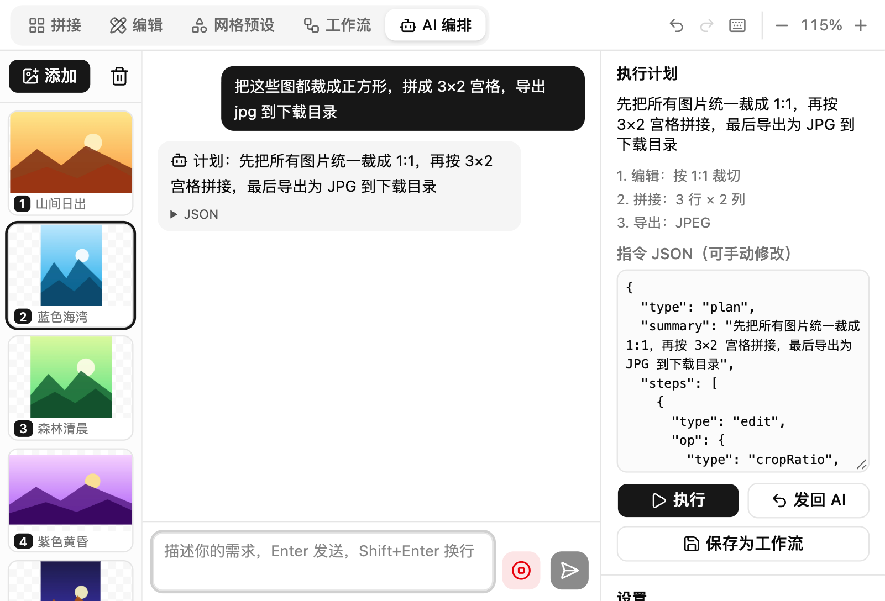

<p align="center"></p>

<h1 align="center">快拼图</h1>

<p align="center">uTools 插件：选中图片一键拼图，支持等高拼接、宫格、长图，附带图片编辑、批量工作流和 AI 编排。</p>



## 功能

- **等高 / 等宽拼接**：尺寸不同的图片自动对齐，可以指定输出宽高，留空时自动选最合适的尺寸
- **宫格与自由网格**：内置多种版式，格子可以拖动、拆分、调整大小，逐格设置适配、对齐和背景
- **图层列表**：拖动排序、拖动序号换位、替换和移除，与画布选择同步
- **网格预设**：保存版式和图片序号，可以注册为 uTools 动态指令
- **图片编辑**：旋转、翻转、裁切、缩放，可以批量应用
- **工作流**：把编辑、拼接、导出串起来批量处理，可以注册为 uTools 动态指令
- **AI 编排**：通过 uTools AI 用一句话生成执行计划，指令使用 JSON 协议，并且只能调用插件内的功能
- 撤销 / 重做、快捷键、画布独立缩放（支持触控板）

完整的使用说明见 [release/发布文案.md](release/发布文案.md)。

| | |
| --- | --- |
|  |  |
|  |  |

## 技术栈

- 前端：React 19 + Vite + Tailwind CSS v4 + shadcn/ui（Radix）+ zustand
- 图片处理：uTools 内置的 `utools.sharp`（libvips），在 `public/preload.js` 中调用
- 运行环境：uTools 8（Electron 34 / Chromium 132 / Node 20）

## 开发

```bash
pnpm install
pnpm build        # 输出到 dist/
pnpm watch        # 监听修改并持续构建
```

在 uTools 开发者工具中导入 **`dist/plugin.json`**（不要导入 `public/plugin.json`）。

目录说明：

- `public/preload.js`：preload 桥接层（CommonJS，原样复制到 dist，不打包也不压缩，符合 uTools 审核要求）
- `public/package.json`：声明 `"type": "commonjs"`，避免根目录的 `"type": "module"` 让 preload 被当成 ES 模块加载
- `public/plugin.json`：功能与指令配置
- `src/`：前端界面
- `release/`：发布用的 Logo、截图和文案
